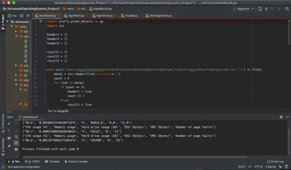
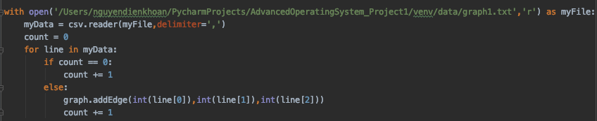
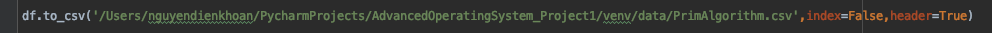

# Advanced Operating System - Project 1

## Student information
Name: Bao Dien Quoc Nguyen
R#: 11660127

## Instructions

[Link to the code](https://texastechuniversity-my.sharepoint.com/:u:/g/personal/bao_d_nguyen_ttu_edu/ERyqkjNKJAtEjxe1AGHOzwEBL81cuuoi47LPw-Wjbter8w?e=UjQyx4)

#### Step 1:
Download and open the source code by [PyCharm CE](https://www.jetbrains.com/pycharm/download/#section=mac)

#### Step 2:
Change paths to graph1.txt for reading graph input in Algorithm1.py, Algorithm2.py, and BothAlgorithms.py

and paths to the location for saving files in these three codes

Change paths to saving files above in drawResult.py

#### Step 3:
Run in order: Algorithm1.py, Algorithm2.py, BothAlgorithms.py, and drawResult.py.

## Results
### Tables
[Algorithm 1](Algorithm1.csv)

[Algorithm 2](Algorithm2.csv)

[Both algorithms](BothAlgorithms.csv)

### CPU usage as percentage

### Memory usage as percentage

### Hard drive usage in kB

### Resident set size in Bytes

### Number of page faults

