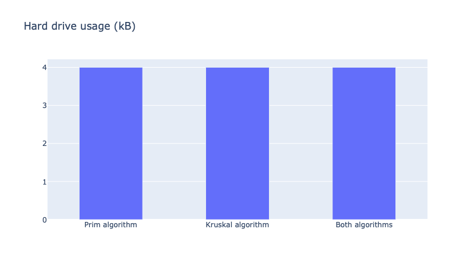

# Advanced Operating System - Project 1

## Student information
Name: Bao Dien Quoc Nguyen
R#: 11660127

## Results
### Tables
[Algorithm 1](Algorithm1.csv)
[Algorithm 2](Algorithm2.csv)
[Both algorithms](BothAlgorithms.csv)

### CPU usage as percentage

### Memory usage as percentage

### Hard drive usage in kB

### Resident set size in Bytes

### Number of page faults

