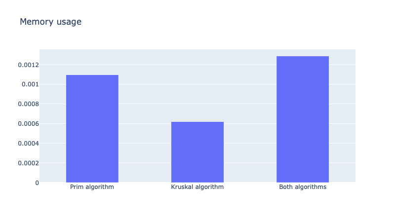

# Advanced Operating System - Project 1

## Student information
Name: Bao Dien Quoc Nguyen
R#: 11660127

## Instructions

[Link to the code](https://texastechuniversity-my.sharepoint.com/:u:/g/personal/bao_d_nguyen_ttu_edu/ERyqkjNKJAtEjxe1AGHOzwEBL81cuuoi47LPw-Wjbter8w?e=UjQyx4)

#### Step 1:
Download and open the source code by PyCharm CE

## Results
### Tables
[Algorithm 1](Algorithm1.csv)

[Algorithm 2](Algorithm2.csv)

[Both algorithms](BothAlgorithms.csv)

### CPU usage as percentage

### Memory usage as percentage

### Hard drive usage in kB

### Resident set size in Bytes

### Number of page faults

